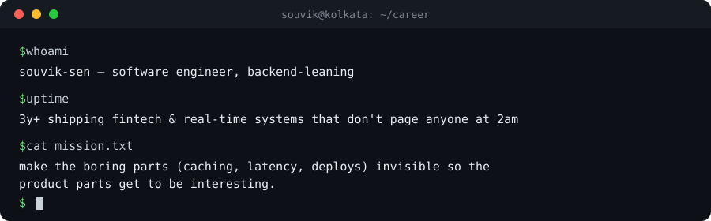

<div align="center">



### I make backend systems boring — in the best way.
Fast, predictable, and never the reason your pager goes off at 2am.

</div>

<br>

```
╔══════════════════════════════════════════════════════════════════╗
║  connected to souvik_sen.db (production, read-only)                ║
║  SELECT * FROM engineers WHERE obsession = 'reliability';           ║
╚══════════════════════════════════════════════════════════════════╝
```

<br>

## `TABLE developer`

| id | name | role | location | employer | years_exp | status |
|---|---|---|---|---|---|---|
| 1 | Souvik Sen | Software Engineer | Kolkata, IN | Phlo Systems | 3+ | `operational` |

`1 row returned` — full-stack, backend-leaning. The kind of engineer people notice only when something *stops* being slow.

<br>

## `TABLE experience`

```sql
SELECT company, duration, key_contribution
FROM experience
ORDER BY start_date DESC;
```

| company | duration | key contribution |
|---|---|---|
| Phlo Systems | Feb 2024 – present | Architected **FinPhlo**, a trade-finance platform for 50+ enterprise clients. Cut redundant API calls 90% via caching + invalidation. Real-time dashboards (SignalR + PWA) cut refresh lag 70%. Feature-flag rollouts on Azure App Config for zero-downtime deploys. |
| Quantorix Technology | Nov 2022 – Feb 2024 | Built commodity-trading UI in React + Redux-Saga. Lifted retention 30% shipping critical trade-execution features. Cut page load 35% via lazy loading and selective re-renders. |
| Matricula | Aug 2022 – Oct 2022 | Shipped a mock-test platform with Razorpay payments. Automated CI/CD on DigitalOcean, cutting manual deploy time 80%. |
| Quordnet Academy | Dec 2021 – Jul 2022 | Built logistics backend APIs on MERN, with webhook-driven real-time status updates. |

`4 rows returned` — no gaps, no unexplained jumps.

<br>

## `QUERY: performance_optimizations`

```sql
SELECT metric, before_value, after_value, method
FROM optimizations
ORDER BY impact_pct DESC;
```

| metric | before | after | method |
|---|---|---|---|
| API calls / session | 100% | **10%** | client-side caching + smarter invalidation |
| deploy time | manual (~40 min) | **automated (~8 min)** | GitHub Actions CI/CD |
| dashboard refresh latency | baseline | **−70%** | SignalR + PWA real-time layer |
| page load time | baseline | **−35%** | lazy loading, payload trimming, selective re-renders |
| trade-execution retention | baseline | **+30%** | Redux-Saga driven UX fixes |

`5 rows returned in 0.003s` — every number is tied to a shipped feature, not a benchmark in isolation.

<br>

## `TABLE projects`

```sql
SELECT name, type, status, description FROM projects;
```

| name | type | status | description |
|---|---|---|---|
| **FinPhlo** | fintech platform | `production` · 50+ clients | Trade-finance lifecycle system. The primary source of the metrics above. |
| **claude-code-gateway** | dev tooling (Python) | `v1.0.0 released` | Local gateway that lets Claude Code run through Gemini or any LiteLLM-supported provider instead of Anthropic's API directly. Cross-platform CLI, MIT licensed. *(mildly funny that you might be reading this via a model that could, in theory, be routed through it.)* |
| **NotifyFlux** | real-time infra | `active` | Multi-tenant notification engine — Socket.IO + MongoDB change streams, built for guaranteed delivery, not best-effort. |
| **Scayul** | B2B SaaS | `active` | Referral automation platform — partner CRM, automated email flows, full MERN stack, built solo end-to-end. |
| **ClearSocial** | social backend | `active` | Feed ranking + Redis caching + autoscaling on AWS. Designed to survive a traffic spike, not just a demo. |
| **PepHub** | CMS | `active` | Next.js blogging platform with a built-in LaTeX resume builder. Edge-rendered on Vercel. |
| **react-dragdrop-kit** | OSS library | `published` | Lightweight drag-and-drop toolkit — sortable lists, grids, boards. [Live demo](https://react-dragdrop-kit.netlify.app/). |
| **Ride Allocation API** | system design | `work in progress` | Driver–passenger matching at scale using REST + load balancing + Redis queues. |

`8 rows returned`

<br>

## `TABLE open_source_packages`

```sql
SELECT package, install, purpose FROM npm_registry WHERE author = 'yourstruggle11';
```

| package | install | purpose |
|---|---|---|
| `git-time-travel` | `npm i git-time-travel` | CLI to edit commit timestamps without rewriting history |
| `noexgen` | `npm i noexgen` | Opinionated Express.js app generator — zero bikeshedding on structure |
| `@yourstruggle11/unslugify` | `npm i @yourstruggle11/unslugify` | Converts slugs back into clean, human-readable titles |
| `react-dragdrop-kit` | see [demo](https://react-dragdrop-kit.netlify.app/) | Drag-and-drop toolkit for React |

<br>

## `TABLE blog_posts`

```sql
-- full archive: medium.com/@yourstruggle11
SELECT title, published FROM medium_posts ORDER BY published DESC;
```

| title | published |
|---|---|
| [Understanding Reconciliation in React 19 & 19.2](https://yourstruggle11.medium.com/react-19-reconciliation-deep-dive-ed433ce1e375) | Nov 2025 |
| [Your Google Maps Works Because of Einstein's Equations](https://yourstruggle11.medium.com/your-google-maps-works-because-of-einstein-848d83916777) | Nov 2025 |
| [Drag and Drop in React Doesn't Have to Be Painful — Meet react-dragdrop-kit](https://yourstruggle11.medium.com/drag-and-drop-in-react-doesnt-have-to-be-painful-meet-react-dragdrop-kit-4c73b5022145) | Oct 2025 |
| [Understanding React Reconciliation in React 18: A Deep Dive](https://yourstruggle11.medium.com/understanding-react-reconciliation-in-react-18-a-deep-dive-16b083e5592a) | Jun 2023 · `3.3k views` |
| [Mastering Design Patterns in React](https://yourstruggle11.medium.com/mastering-design-patterns-in-react-a-comprehensive-guide-836a288af34) | Jun 2023 |
| [Mastering React: Best Practices for High-Quality Applications](https://yourstruggle11.medium.com/mastering-react-best-practices-for-building-high-quality-applications-6b60e4e66f7a) | Jun 2023 |
| [Unleashing the Power of Performance Optimization](https://yourstruggle11.medium.com/unleashing-the-power-of-performance-optimization-in-web-applications-bf23272d06e) | Jun 2023 |
| [Git Time Travel: A Guide to Manipulating Git History](https://yourstruggle11.medium.com/git-time-travel-a-guide-to-manipulating-git-history-937d314d39f8) | Feb 2023 |
| [Introducing NoExGen](https://yourstruggle11.medium.com/introducing-noexgen-a-node-express-application-generator-e8c657cb36f) | Feb 2023 |

<br>

## `EXPLAIN ANALYZE` — how I actually work

```
1. Reproduce the slow path before touching code. "Feels slow" isn't a metric.
2. Fix the cache/invalidation layer before reaching for a bigger instance.
3. Ship behind a flag. Zero-downtime isn't optional once real clients depend on you.
4. Write the CI check once. Never explain a deploy step to a teammate twice.
```

<br>

## `TABLE github_activity` — live, not a snapshot

<div align="center">


</div>

This block re-queries itself every time someone loads the page — the only section of this README that isn't lying to you by the time you read it.

<br>

## `INSERT INTO job_search (status) VALUES ('open')`

```sql
SELECT role_type, work_mode, best_contact FROM job_search WHERE status = 'open';
```

| role_type | work_mode | best_contact |
|---|---|---|
| Senior Frontend / Full-Stack | remote-friendly | email or LinkedIn |

<br>

## `$ exit`

```
$ SELECT status FROM engineer WHERE name = 'souvik_sen';

 status
--------------------------------------------
 online · shipping · occasionally over-caffeinated
(1 row)

logout
Connection to souvik-sen closed.
```

<div align="center">

<a href="mailto:yourstruggle11@gmail.com"></a>
<a href="https://www.linkedin.com/in/yourstruggle11"></a>
<a href="https://yourstruggle11.medium.com"></a>
<a href="https://yourstruggle11.netlify.app"></a>

</div>
